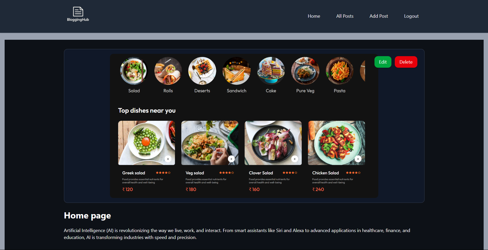
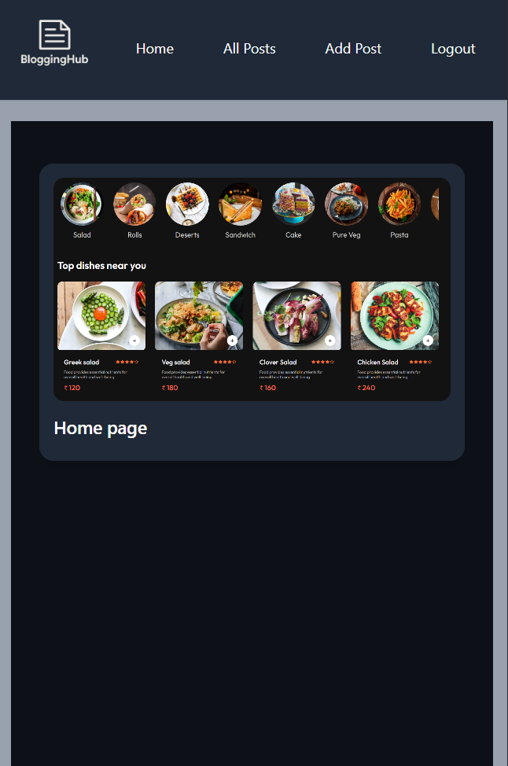

# BloggingHub 📝

A modern blogging platform built with **React.js** and **Appwrite** for authentication, posts management, and storage. Write, publish, and manage blog posts with a beautiful, minimal UI.

---

## 🚀 Features

✅ User authentication (signup, login, logout) with Appwrite Auth  
✅ Add, edit, and delete blog posts  
✅ Upload and display featured images for posts  
✅ Responsive, modern UI with Tailwind CSS  
✅ Dynamic routing for individual post pages  
✅ Secure backend with Appwrite Collections & Storage  
✅ Post cards with metadata (title, date, author)  
✅ Dark-themed interface for better readability

---

## 🛠️ Tech Stack

- **Frontend:** React.js, React Router, Tailwind CSS  
- **Backend:** Appwrite (Auth, Database, Storage)  
- **Hosting:** Your choice (e.g., Vercel, Netlify, GitHub Pages)  
- **Other:** ESLint & Prettier for code quality

---

## 📸 Screenshots




---

## 📦 Installation

1️⃣ Clone the repository:
```bash
git clone https://github.com/yourusername/blogginghub.git
cd blogginghub
```
2️⃣ Install dependencies:
```bash
npm install
```
3️⃣ Create an .env file for reference use .env.sample in the root with your Appwrite configuration:

4️⃣ Run the app locally:
```bash
npm run dev
```
### 🔗 Appwrite Setup
1.Deploy Appwrite on your server or use Appwrite Cloud.

2.Create a project and note your Project ID.

3.Set up the following in Appwrite console:

4.Authentication: Enable email/password sign-in.

5.Database: Create a collection for posts (e.g., posts) with fields like title, slug, content, featuredImage, etc.

6.Storage: Create a bucket for uploading featured images.

6.Add your frontend domain (localhost or production URL) to Appwrite project's allowed hosts.

### ✅ Usage
Register/Login: Users can register and login using Appwrite Auth.

Add Post: Authenticated users can create new blog posts.

View Posts: Posts are displayed on the homepage with featured images and metadata.

View Single Post: Click a post card to navigate to the full post page.

Edit/Delete: Manage posts from your dashboard (if implemented).

### 👨‍💻 Contributing
Pull requests are welcome! Feel free to open an issue or suggest features.